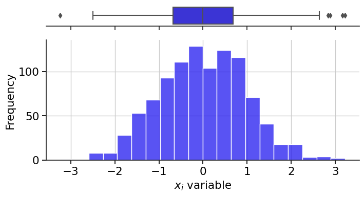

<!--Don't delete ths script-->
<script src = "https://polyfill.io/v3/polyfill.min.js?features=es6"></script>
<script id = "MathJax-script" async src="https://cdn.jsdelivr.net/npm/mathjax@3/es5/tex-mml-chtml.js"></script>
<!--Don't delete ths script-->


<p align = "justify">
The authors chose functional programming to develop the framework.</code>.
</p>

<p align = "justify">The SAMPLING function generates a set of random numbers according to a specified distribution type. Input parameters include the number of samples, data dimension, sampling model, and descriptions of variables along with their distributions. The function supports distributions such as Normal, Uniform, Gumbel, Lognormal, and Triangular. It returns an array of random samples and a list of initial states used in the sampling process..</p>


<h2><b><code>SAMPLING</code></b></h2>
<p align = "justify">
This function generates random samples according to chosen sampling method.
</p>

Input variables
{: .label .label-yellow }

<table style = "width:100%">
    <tr>
        <td>N_POP</td>
        <td>Total of samplings</td>
        <td>Integer</td>
    </tr>
    <tr>
        <td>D</td>
        <td>Problem dimension</td>
        <td>Integer</td>
    </tr>
    <tr>
        <td>MODEL</td>
        <td>Algorithm setup</td>
        <td>String</td>
    </tr>
    <tr>
        <td></td>
        <td><code>'MCS'</code>: Monte Carlo Sampling</td>
        <td></td>
    </tr>
    <tr>
        <td></td>
        <td><code>'LHS'</code>: Latim Hypercube Sampling</td>
        <td></td>
    </tr>
    <tr>
        <td>VARS</td>
        <td>Variables setup <code>[VAR_0, VAR_1, ..., VAR_N]</code></td>
        <td>Py list[D]</td>
    </tr>
    <tr>
        <td></td>
        <td>Variable setup example</td>
        <td>Py list[D]</td>
    </tr>
    <tr>
        <td><code>[0]</code></td>
        <td>Type of probability distribution</td>
        <td>String</td>
    </tr>
    <tr>
        <td><code>[1]</code></td>
        <td>Mean (\(\mu\))</td>
        <td>Float</td>
    </tr>
    <tr>
        <td><code>[2]</code></td>
        <td>Standard deviation (\(\sigma\))</td>
        <td>Float</td>
    </tr>
</table>

{: .note}
> The list of distributions used in `VARS` are:
> - Normal or Gaussian = `"NORMAL"`;  
> - Gumbel Maximum = `"GUMBEL MAX"`;  
> - Gumbel Minimum = `"GUMBEL MIN"`;    
> - Log Normal = `"LOGNORMAL"`;  
> - Uniform = `"UNIFORM"`;  

Output variables
{: .label .label-yellow }

<table style = "width:100%">
    <tr>
        <td>RANDOM_SAMPLING</td>
        <td>Samples</td>
        <td>Py Numpy array[N_POP x D]</td>
    </tr>
</table>

Example 1
{: .label .label-green }

<p align = "justify">In this example, we will use the SAMPLING function to generate a set of random samples following a Normal distribution. In this example, two sets of variables will be constructed with this distribution.</p>

```python
#!pip install PARE-TOOLBOX
from PARE_TOOLBOX import *

randomNumbers, randomStates = SAMPLING(N_POP = 5, D = 2, MODEL = 'MCS', VARS = [['NORMAL', 0, 1], ['NORMAL', 5, 1.2]])
print(randomNumbers)

print(randomStates)
```

```cmd
[[ 1.22059024  5.12709222]
 [-0.96520732  3.86123554]
 [ 0.67916488  4.69650537]
 [ 0.03988433  5.31350454]
 [ 0.66733767  5.9521967 ]]

[210, 367]
```

<p align = "center"><b>Figure 1.</b> Normal distribution using Sampling function.</p>
<center></center>


Example 2
{: .label .label-yellow }

<p align = "justify">In this example, we will explore the SAMPLING function to generate random samples following the Gumbel Maximum (Gumbel Max) distribution. The Gumbel Max distribution is commonly used to model extreme value events, making it useful in various fields such as engineering and finance. We will set the number of samples to 1000 and the dimension to 1. Using the "MCS" (Monte Carlo Sampling) sampling model, we will configure a variable with the Gumbel Max distribution, specifying the location and scale parameters. Through this example, we will demonstrate how the SAMPLING function facilitates the generation of random samples that follow different distributions.</p>

```python
pip install PARE-TOOLBOX
from PARE_TOOLBOX import *
import numpy as np
import pandas as pd

kwargs = {
    'N_POP': 1000,
    'D': 1,
    'MODEL': 'MCS',
    'VARS': [
        ('GUMBEL MAX', 0, 1),
    ]
}

random, random_state = SAMPLING(**kwargs)
random_sampling = random.flatten()

# Data
DF =  pd.DataFrame({'col1': random_sampling})
COLUMN = 'col1'

# Chart config
CHART_CONFIG = {
              'NAME': f"{COLUMN}_Histogram",
              'EXTENSION': 'svg',
              'WIDTH': 0.20, 
              'HEIGHT': 0.10,
              'X AXIS LABEL': '$x_{i}$ variable',
              'X AXIS SIZE': 15.5,
              'Y AXIS LABEL': 'Frequency',
              'Y AXIS SIZE': 15.5,
              'AXISES COLOR': '#000000',
              'LABELS SIZE': 15.5,
              'LABELS COLOR': '#000000', 
              'CHART COLOR': '#2219F0',
              'BINS': 20,
              'DPI': 600,
             }

# Data statement 
DATA = {
         'DATASET': DF,
         'COLUMN': COLUMN        
       }  

# Call function
HISTOGRAM_CHART(DATASET = DATA, PLOT_SETUP = CHART_CONFIG)
```

<p align = "center"><b>Figure 2.</b> Gumbel Distribution using Sampling function.</p>
<center></center>


Example 3
{: .label .label-yellow }

<p align = "justify">In this new example, we will delve into the SAMPLING function once again, this time generating random samples that adhere to the Gumbel Minimum (Gumbel Min) distribution. The Gumbel Min distribution is commonly employed to model extreme minimum values, making it suitable for applications such as analyzing rare events in engineering and environmental sciences. With the number of samples set at 1000 and the dimension at 1, we will utilize the "MCS" (Monte Carlo Sampling) sampling model. By configuring a variable with the Gumbel Min distribution, specifying the location and scale parameters, we will demonstrate how the SAMPLING function facilitates the creation of random samples that align with distinct distributions.</p>

```python
pip install PARE-TOOLBOX
from PARE_TOOLBOX import *
import numpy as np
import pandas as pd

kwargs = {
    'N_POP': 1000,
    'D': 1,
    'MODEL': 'MCS',
    'VARS': [
        ('GUMBEL MIN', 0, 1),
    ]
}

random, random_state = SAMPLING(**kwargs)
random_sampling = random.flatten()

# Data
DF =  pd.DataFrame({'col1': random_sampling})
COLUMN = 'col1'

# Chart config
CHART_CONFIG = {
              'NAME': f"{COLUMN}_Histogram",
              'EXTENSION': 'svg',
              'WIDTH': 0.20, 
              'HEIGHT': 0.10,
              'X AXIS LABEL': '$x_{i}$ variable',
              'X AXIS SIZE': 15.5,
              'Y AXIS LABEL': 'Frequency',
              'Y AXIS SIZE': 15.5,
              'AXISES COLOR': '#000000',
              'LABELS SIZE': 15.5,
              'LABELS COLOR': '#000000', 
              'CHART COLOR': '#2219F0',
              'BINS': 20,
              'DPI': 600,
             }

# Data statement 
DATA = {
         'DATASET': DF,
         'COLUMN': COLUMN        
       }  

# Call function
HISTOGRAM_CHART(DATASET = DATA, PLOT_SETUP = CHART_CONFIG)
```

<p align = "center"><b>Figure 3.</b> Gumbel Distribution using Sampling function.</p>
<center></center>

Example 4

In this new example, we will utilize the SAMPLING function once again to generate a set of random samples following a Lognormal distribution. The Lognormal distribution is frequently employed to model data with positive skewness and non-symmetrical distribution. We will set the number of samples to 2000 and the dimension to 1. Employing the "MCS" (Monte Carlo Sampling) sampling model, we will configure a variable with a Lognormal distribution, specifying the shape and location parameters. Through this example, we aim to illustrate how the SAMPLING function can be applied to generate random samples adhering to diverse distributions.


```python
pip install PARE-TOOLBOX
from PARE_TOOLBOX import *
import numpy as np
import pandas as pd

kwargs = {
    'N_POP': 2000,
    'D': 1,
    'MODEL': 'MCS',
    'VARS': [
        ('LOGNORMAL', 0.5, 1),
    ]
}

random, random_state = SAMPLING(**kwargs)
random_sampling = random.flatten()

# Data
DF =  pd.DataFrame({'col1': random_sampling})
COLUMN = 'col1'

# Chart config
CHART_CONFIG = {
              'NAME': f"{COLUMN}_Histogram",
              'EXTENSION': 'svg',
              'WIDTH': 0.20, 
              'HEIGHT': 0.10,
              'X AXIS LABEL': '$x_{i}$ variable',
              'X AXIS SIZE': 15.5,
              'Y AXIS LABEL': 'Frequency',
              'Y AXIS SIZE': 15.5,
              'AXISES COLOR': '#000000',
              'LABELS SIZE': 15.5,
              'LABELS COLOR': '#000000', 
              'CHART COLOR': '#2219F0',
              'BINS': 20,
              'DPI': 600,
             }

# Data statement 
DATA = {
         'DATASET': DF,
         'COLUMN': COLUMN        
       }  

# Call function
HISTOGRAM_CHART(DATASET = DATA, PLOT_SETUP = CHART_CONFIG)
```

<p align = "center"><b>Figure 3.</b> Gumbel Distribution using Sampling function.</p>
<center></center>

[Notebook example](https://mega.nz/file/31FFDIAZ#zVEB5y81VjlbIazIijpgqzTFTxLtmqJVpnA6QAF7vjA){: .btn .btn-outline }
