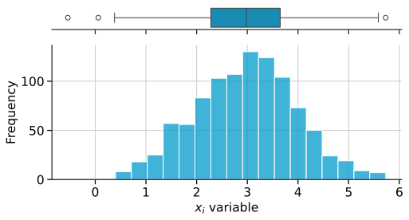
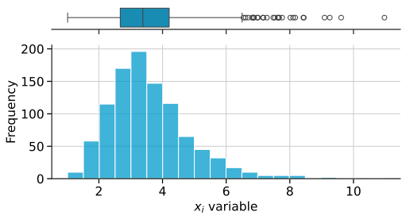
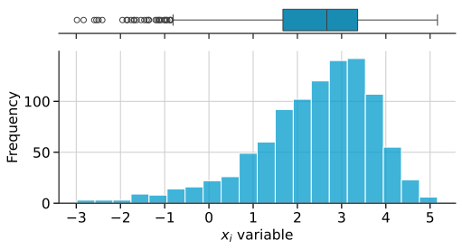
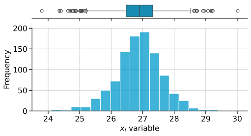
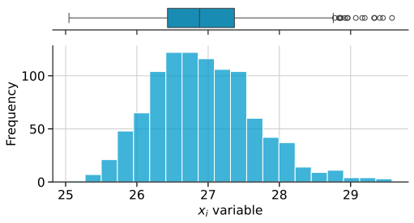

<!--Don't delete ths script-->
<script src = "https://polyfill.io/v3/polyfill.min.js?features=es6"></script>
<script id = "MathJax-script" async src="https://cdn.jsdelivr.net/npm/mathjax@3/es5/tex-mml-chtml.js"></script>
<!--Don't delete ths script-->

<h3>sampling</h3>

<br>

<p align = "justify">
    This algorithm generates a set of random numbers according to a type of distribution.
</p>

```python
random_sampling = sampling(n_samples, d, model, variables_setup)
```

Input variables
{: .label .label-yellow }

<table style = "width:100%">
    <thead>
      <tr>
        <th>Name</th>
        <th>Description</th>
        <th>Type</th>
      </tr>
    </thead>
    <tr>
        <td><code>n_samples</code></td>
        <td>Number of samples</td>
        <td>Integer</td>
    </tr>
    <tr>
        <td><code>d</code></td>
        <td>Number of dimensions</td>
        <td>Integer</td>
    </tr>
    <tr>
        <td><code>model</code></td>
        <td><a href="#mode">Model parameters</a></td>
        <td>Dictionary</td>
    </tr>
    <tr>
        <td><code>variables_setup</code></td>
        <td><a href="#vars">Variables parameters</a></td>
        <td>List</td>
    </tr>
</table>

Output variables
{: .label .label-yellow}

<table style = "width:100%">
   <thead>
     <tr>
       <th>Name</th>
       <th>Description</th>
       <th>Type</th>
     </tr>
   </thead>
   <tr>
       <td><code>random_sampling</code></td>
       <td>Random samples.</td>
       <td>Numpy array</td>
   </tr>
</table>

<p align = "justify" id = "mode">
    See examples of model parameters.
</p>

<h4><i>Crude Monte Carlo</i></h4>

```python
'numerical model': {'model sampling': 'mcs'}
```

<table style = "width:100%">
    <thead>
      <tr>
        <th>Name</th>
        <th>Description</th>
        <th>Type</th>
      </tr>
    </thead> 
    <tr>
        <td><code>'model sampling'</code></td>
        <td>Numerical algorithm used in sampling generator</td>
        <td>String</td>
    </tr>
</table>

<h4><i>Crude Monte Carlo - Stochastic analysis</i></h4>

```python
'numerical model': {'model sampling': 'mcs-time', 'time analysis': 5}
```

<table style = "width:100%">
    <thead>
      <tr>
        <th>Name</th>
        <th>Description</th>
        <th>Type</th>
      </tr>
    </thead> 
    <tr>
        <td><code>'model sampling'</code></td>
        <td>Numerical algorithm used in sampling generator</td>
        <td>String</td>
    </tr>
    <tr>
        <td><code>'time analysis'</code></td>
        <td>Number of time steps used in times series analysis</td>
        <td>Integer</td>
    </tr>
</table>


<p align = "justify" id = "vars">
    See examples of variables parameters.
</p>

<h4><i>Normal sampling</i></h4>

```python
{'type': 'normal', 'loc': 40.3, 'scale': 4.64, 'seed': None}
```

<table style = "width:100%">
    <thead>
      <tr>
        <th>Name</th>
        <th>Description</th>
        <th>Type</th>
      </tr>
    </thead> 
    <tr>
        <td><code>'loc'</code></td>
        <td>Mean</td>
        <td>Float</td>
    </tr>
    <tr>
        <td><code>'scale'</code></td>
        <td>Standard deviation</td>
        <td>float</td>
    </tr>
    <tr>
        <td><code>'seed'</code></td>
        <td>Random seed. Use <code>None</code> for random seed</td>
        <td>float</td>
    </tr>
</table>

Example 1
{: .label .label-blue }

<p align = "justify">
    <i>In this example, we will use the <code>sampling</code> function to generate a set of random samples \((n=1000)\) following a Normal distribution with mean \(\mu = 3.00\) and standard deviation \(\sigma = 1.00\). Use "seed without control" in your setup.</i>
</p>

```python
from parepy_toolbox import sampling

# Dataset
model = {'model sampling': 'mcs'}
f = {'type': 'normal', 'loc': 3.00, 'scale': 1.00, 'seed': None}
varSet = [f]

# Call function
randomVariables = sampling(1000, len(varSet), model, varSet)

# Output details
print(f'random variables n={len(randomVariables)}: \n\n {randomVariables} \n\n type variable: {type(randomVariables)}')
```

```bash
random variables n=1000: 

 [[2.01162417]
 [2.68475353]
 [2.78796797]
 [2.36281564]
 [4.60781551]
 [3.59727946]
 [2.24979497]
 [2.99149908]
...
 [1.31969787]
 [2.71006801]] 

 type variable: <class 'numpy.ndarray'>
```

<p align = "center"><b>Figure 1.</b> Normal Distribution using Sampling function.</p>
<center></center>

Example 2
{: .label .label-blue }

<p align = "justify">
    <i>In this example, we will use the <code>sampling</code> function to generate a set of random samples \((n=1000)\) following a Gumbel Max distribution with mean \(\mu = 3.00\) and standard deviation \(\sigma = 1.00\). Use "seed without control" in your setup.</i>
</p>

```python
from parepy_toolbox import sampling

# Dataset
model = {'model sampling': 'mcs'}
f = {'type': 'gumbel max', 'loc': 3.00, 'scale': 1.00, 'seed': None}
varSet = [f]

# Call function
randomVariables = sampling(1000, len(varSet), model, varSet)

# Output details
print(f'random variables n={len(randomVariables)}: \n\n {randomVariables} \n\n type variable: {type(randomVariables)}')
```

```bash
random variables n=1000: 

 [[2.54344536]
 [3.4132256 ]
 [2.07157173]
 [3.17322365]
 [5.08129471]
 [4.8650879 ]
 [3.12570801]
 [3.07478402]
...
 [4.24404437]
 [6.77645712]]

 type variable: <class 'numpy.ndarray'>
```

<p align = "center"><b>Figure 2.</b> Gumbel Max Distribution using Sampling function.</p>
<center></center>

Example 3
{: .label .label-blue }

<p align = "justify">
    <i>In this example, we will use the <code>sampling</code> function to generate a set of random samples \((n=1000)\) following a Gumbel Min distribution with mean \(\mu = 3.00\) and standard deviation \(\sigma = 1.00\). Use "seed without control" in your setup.</i>
</p>

```python
from parepy_toolbox import sampling

# Dataset
model = {'model sampling': 'mcs'}
f = {'type': 'gumbel min', 'loc': 3.00, 'scale': 1.00, 'seed': None}
varSet = [f]

# Call function
randomVariables = sampling(1000, len(varSet), model, varSet)

# Output details
print(f'random variables n={len(randomVariables)}: \n\n {randomVariables} \n\n type variable: {type(randomVariables)}')
```

```bash
random variables n=1000: 

 [[ 3.54288578e+00]
 [ 1.31047287e+00]
 [ 1.58150807e+00]
 [ 2.58028790e+00]
 [ 2.12311530e+00]
 [ 3.10283340e+00]
 [ 1.04313183e+00]
 [ 7.91284471e-01]
...
 [ 3.48637502e+00]
 [ 2.03970523e+00]]

 type variable: <class 'numpy.ndarray'>
```

<p align = "center"><b>Figure 3.</b> Gumbel Min Distribution using Sampling function.</p>
<center></center>

Example 4
{: .label .label-blue }

<p align = "justify">
    <i>In this example, we will use the <code>sampling</code> function to generate a set of random samples \((n=1000)\) following a Weibull distribution with shape \(shape = 1.17015\), mean \(\mu = 26.880557\) and standard deviation \(\sigma = 0.576488\). Use "seed without control" in your setup.</i>
</p>

```python
from parepy_toolbox import sampling

# Dataset
model = {'model sampling': 'mcs'}
f = {'type': 'weibull', 'shape': 1.17015, 'loc': 26.880557, 'scale': 0.576488, 'seed': None}
varSet = [f]

# Call function
randomVariables = sampling(1000, len(varSet), model, varSet)

# Output details
print(f'random variables n={len(randomVariables)}: \n\n {randomVariables} \n\n type variable: {type(randomVariables)}')
```

```bash
random variables n=1000: 

 [[26.23607505]
 [26.80557165]
 [27.65502771]
 [26.63109136]
 [25.91253973]
 [27.07699283]
 [25.25182475]
 [27.10024372]
...
 [25.92168856]
 [27.3081249 ]]

 type variable: <class 'numpy.ndarray'>
```

<p align = "center"><b>Figure 4.</b> Weibull Distribution using Sampling function.</p>
<center></center>

Example 5
{: .label .label-blue }

<p align = "justify">
    <i>In this example, we will use the <code>sampling</code> function to generate a set of random samples \((n=1000)\) following a Lognormal distribution with shape \(shape = 0.201674\), mean \(\mu = 23.39\) and standard deviation \(\sigma = 3.46\). Use "seed without control" in your setup.</i>
</p>

```python
from parepy_toolbox import sampling

# Dataset
model = {'model sampling': 'mcs'}
f = {'type': 'lognormal', 'shape': 0.201674, 'loc': 23.39, 'scale': 3.46, 'seed': None}
varSet = [f]

# Call function
randomVariables = sampling(1000, len(varSet), model, varSet)

# Output details
print(f'random variables n={len(randomVariables)}: \n\n {randomVariables} \n\n type variable: {type(randomVariables)}')
```

```bash
random variables n=1000: 

 [[26.51855105]
 [26.36110399]
 [25.45837593]
 [25.04686538]
 [27.07251459]
 [26.31081944]
 [27.84407454]
 [27.08248368]
...
 [27.17634471]
 [26.73573646]]

 type variable: <class 'numpy.ndarray'>
```

<p align = "center"><b>Figure 5.</b> Lognormal Distribution using Sampling function.</p>
<center></center>


Example 6
{: .label .label-blue }

<p align = "justify">
    <i>In this example, we will use the <code>sampling</code> function to generate a set of random samples \((n=1000)\) following a Normal distribution and a Gumbel Max distribution, both with mean \(\mu = 3.00\) and standard deviation \(\sigma = 1.00\). Use "seed without control" in your setup.</i>
</p>

```python
from parepy_toolbox import sampling

# Dataset
model = {'model sampling': 'mcs'}
f = {'type': 'normal', 'loc': 3.00, 'scale': 1.00, 'seed': None}
v = {'type': 'gumbel max', 'loc': 3.00, 'scale': 1.00, 'seed': None}
varSet = [f, v]

# Call function
randomVariables = sampling(1000, len(varSet), model, varSet)

# Output details
print(f'random variables n={len(randomVariables)}: \n\n {randomVariables} \n\n type variable: {type(randomVariables)}')
```

```bash
random variables n=1000: 

 [[3.38720174 2.66784302]
 [3.49461632 2.76750307]
 [2.9982122  1.83116894]
 ...
 [3.82247618 2.50820437]
 [1.13765184 3.03439417]
 [0.28202896 4.3233388 ]]

 type variable: <class 'numpy.ndarray'>
```

<p align = "center"><b>Figure 6.</b> (a) Normal Distribution and (b) Gumbel Max Distribution using Sampling function.</p>
<center></center>
<p align = "center">(a)</p>
<center></center>
<p align = "center">(b)</p>


Example 7
{: .label .label-blue }

<p align = "justify">
    <i>In this example, we will use the <code>sampling</code> function to generate a set of random samples \((n=1000)\) following a Normal distribution and a Gumbel Min distribution, both with mean \(\mu = 3.00\) and standard deviation \(\sigma = 1.00\). Use "seed without control" in your setup.</i>
</p>

```python
from parepy_toolbox import sampling

# Dataset
model = {'model sampling': 'mcs'}
f = {'type': 'normal', 'loc': 3.00, 'scale': 1.00, 'seed': None}
v = {'type': 'gumbel min', 'loc': 3.00, 'scale': 1.00, 'seed': None}
varSet = [f, v]

# Call function
randomVariables = sampling(1000, len(varSet), model, varSet)

# Output details
print(f'random variables n={len(randomVariables)}: \n\n {randomVariables} \n\n type variable: {type(randomVariables)}')
```

```bash
random variables n=1000: 

 [[4.86230487 3.65774593]
 [3.03147707 1.70716801]
 [3.27870656 2.56084785]
 ...
 [0.90097931 2.21278157]
 [3.0442953  2.38984915]
 [1.88344245 3.77978042]]

 type variable: <class 'numpy.ndarray'>
```

<p align = "center"><b>Figure 7.</b> (a) Normal Distribution and (b) Gumbel Min Distribution using Sampling function.</p>
<center></center>
<p align = "center">(a)</p>
<center></center>
<p align = "center">(b)</p>