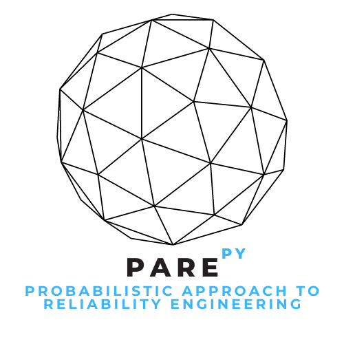

<table>
  <tr>
    <td style="width:70%;">
The PAREpy (<b>Probabilistic Approach Reliability Engineering</b>) platform is a software developed by the research group headed by Professor Wanderlei M. Pereira Junior in the FENG-UFCAT. It is a framework for applying probabilistic concepts to analyze a system containing random variables. The platform is built in Python and can be used in any environment that supports this programming language.
</td>
    <td style="width:30%;"></td>  
  </tr>
</table>  

{: .note }
> If you have any suggestions or error reports regarding the algorithm's functioning, please inform us by email: `wanderlei_junior@ufcat.edu.br`. We will be happy to improve the framework.
