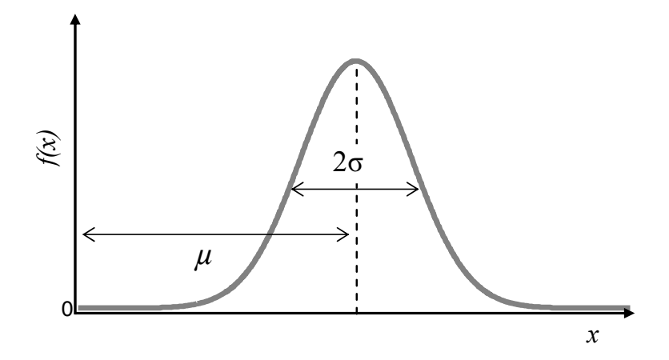

<!--Don't delete this script-->

<!--Don't delete this script-->

Gaussian or Normal
{: .label .label-Blue}

The Gaussian or Normal distribution is by far one of the most important probability distributions in literature, and it is used in many fields of engineering and science due to its simplicity and convenience. This distribution is used to model the Poisson's ratio, among other material properties, for example <a href="#ref1">[1]</a>. It is possible to say that a random variable \(X\) has a Gaussian distribution if its probability density function follows the expression.

<table style = "width:100%">
    <tr>
        <td style="width: 90%;">\[ f_{x}(x)=\frac{1}{\sqrt{2\pi}\sigma}exp\left [ - \frac{1}{2}\left ( \frac{x-\mu}{\sigma} \right ) \right ] \]</td>
        <td style="width: 10%;">
(1)
</td>
    </tr>
</table>

Where the parameters of the distribution \(\mu\) and \(\sigma\) denote the mean and standard deviation of the variable \(X\), respectively, and \(X\) is identified as \(N(\mu,\sigma)\). The location (\(\mu\)) and scale (\(\sigma\)) parameters generate a family of distributions, as a presented in Figure 1.

<b>Figure 1.</b> Normal Density Function.

 

Gumbel Maximum
{: .label .label-Blue}

 

Gumbel Minimum
{: .label .label-Blue}

 

Lognormal
{: .label .label-Blue}

The lognormal distribution performs an important role for engineering in general, since such function is only defined for positive values and there are a large number of physical phenomena that cannot be negative. This distribution can be applied to describe earthquakes distribution, structural failure due to fatigue, material resistance, the yield strength of steel, among others for instance <a href="#ref1">[1]</a>. 
Suppose a sample of random variable \(X = x_{1},x_{2},x_{3}, ..., x_{n}\) and that the natural logarithms of \(X\) values will be taken, defining a new variable \(Y = \ln{x_{1}},\ln{x_{2}},\ln{x_{3}}, ..., \ln{x_{n}}\). If the variable \(Y\) follows a Normal distribution, then \(X\) is a variable with a lognormal distribution. In other words, if the logarithms of the values of the random variable follow a Normal distribution, then the variable follows a lognormal distribution. 
Thus, it is possible to say that a random variable \(X\) has a lognormal distribution if its probability density function is characterized by Equation 5.

<table style = "width:100%">
    <tr>
        <td style="width: 90%;">\[ f_{x}(x)=\frac{1}{x\sqrt{2\pi}\xi}exp\left [ - \frac{1}{2}\left ( \frac{\ln{x}-\lambda}{\xs} \right ) \right ] \]</td>
        <td style="width: 10%;">
(1)
</td>
    </tr>
</table>

 

Uniform
{: .label .label-Blue}

<h3>Reference list</h3>

<table>
    <thead>
        <tr>
            <th>ID</th>
            <th>Reference</th>
        </tr>
    </thead>
    <tbody>
        <tr>
            <td>
[1]
</td>
            <td>
<a href="https://doi.org/10.1007/978-1-84628-445-8" target="_blank" rel="noopener noreferrer">Choi, S., Canfield, R.A. & Grandhi, R.V.  (2021). https://doi.org/10.1007/978-1-84628-445-8. Springer London, 306 pgs.</a>
</td>
        </tr>
    </tbody>
</table>
